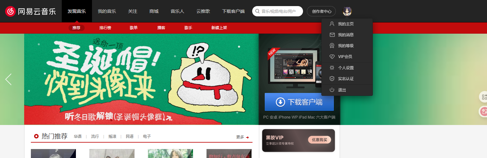
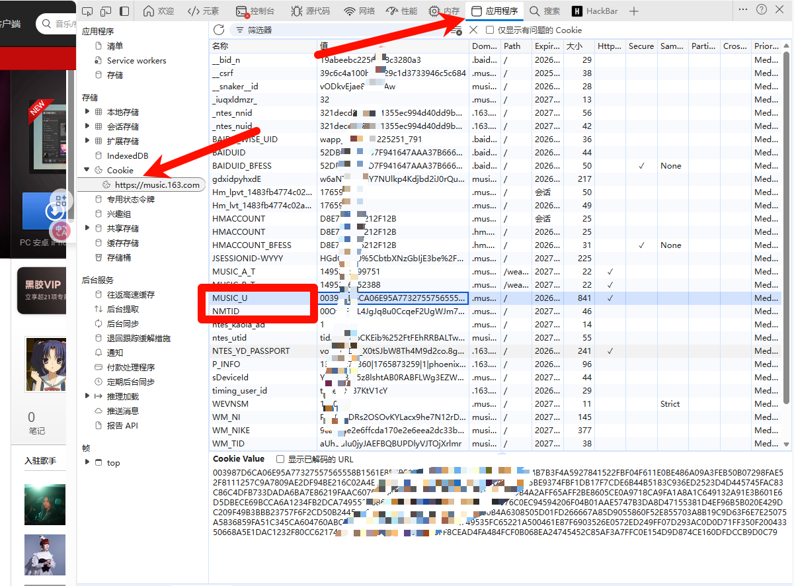

# LyricEase 登录配置工具

## 项目简介

本工具是一个用于自动安装并配置 LyricEase 音乐播放器登录状态的 PowerShell 脚本。

脚本会读取 `cookies.json` 中的网易云 Cookie，把 Cookie 写入 LyricEase 的本地数据目录，并写入最小必要的用户信息到 UWP 的 `settings.dat`，从而让 LyricEase 直接处于已登录状态。

## 使用前准备

### 获取 Cookie 信息

1. **打开浏览器**，确保已经登录网易云音乐网页版 (music.163.com)



2. **打开开发者工具**（F12）
3. **切换到 Application/应用程序 标签页**
4. **在左侧找到 Cookies**，点击展开
5. **找到并复制以下两个 Cookie 值**： - `MUSIC_U` - `NMTID`



提示：脚本校验用户信息主要依赖 `MUSIC_U`，建议同时填写 `NMTID` 以保持 Cookie 更完整。

### 准备安装文件（仅在你未安装 LyricEase 时需要）

把以下两个文件放到脚本同目录：

-   `*.msixbundle`（或 `*.msix`）安装包
-   `*.cer` 证书文件

脚本会自动查找并安装（默认使用目录中“最新修改时间”的文件）。

注意：脚本为了解决证书有效期限制，会**临时把系统时间设置到 2024-10-16 之前**，安装完成后再还原。

## 使用方法

### 第一步：配置 Cookie 文件

编辑 `cookies.json` 文件，填入你的 Cookie 信息：

```json
{
    "NMTID": "你的NMTID值",
    "MUSIC_U": "你的MUSIC_U值"
}
```

### 第二步：运行脚本

脚本需要管理员权限（会导入证书、安装 AppX、并加载/卸载 `settings.dat` 的注册表 hive）。

1. **以管理员身份打开 PowerShell**

    - 右键点击 PowerShell 图标
    - 选择"以管理员身份运行"

2. **导航到脚本目录**

    ```powershell
    cd path\to\LyricEaseLoginHelper
    ```

3. **执行脚本**

    ```powershell
    .\main.ps1
    ```

    如果你装了 gsudo，也可以一条命令提权执行：

    ```powershell
    gsudo powershell -NoProfile -ExecutionPolicy Bypass -File .\main.ps1
    ```

脚本会按顺序执行（根据需要跳过某些步骤）：

1. 检测 LyricEase 是否已安装（未安装则从脚本目录自动安装）
2. 写入 Cookie 文件到 LyricEase 的 `LocalState\cookie`
3. 调用 API 获取用户信息
4. 写入最小必要的登录信息到 `settings.dat`

说明：当前版本的 `main.ps1` 不提供命令行参数；所有输入来自 `cookies.json` 以及脚本目录下的安装包/证书文件。

## 故障排除

### 常见问题

**Q: 提示"需要管理员权限"怎么办？**

A: 请右键点击 PowerShell，选择"以管理员身份运行"

**Q: 运行到步骤 3 提示“客户端没有所需的特权”怎么办？**

A: 同样是管理员权限问题。请用管理员 PowerShell 运行，或用 `gsudo` 提权执行。

**Q: 提示未找到安装包或证书怎么办？**

A: 请将 `*.msixbundle/*.msix` 与 `*.cer` 放到脚本同目录。

**Q: Cookie 无效怎么办？**

A: 请重新登录网易云音乐网页版，获取最新的 Cookie 信息

**Q: 脚本执行后 LyricEase 仍未登录？**

A: 请检查 Cookie 是否正确，并尝试重启 LyricEase 应用

**Q: 证书导入失败或提示证书过期/不在有效期内？**

A: 脚本会自动将系统日期临时调到 2024-10-16 之前再导入证书，并在结束后自动还原。
如果你的系统开启了自动校时/域策略导致时间被立刻改回，可能需要先手动关闭自动校时后重试（脚本也会尝试临时停止 w32time）。

**Q: Add-AppxPackage 安装失败？**

A: 请确认：

-   系统允许安装 sideload（开发者模式/旁加载设置）
-   安装包架构与你的系统匹配
-   证书已正确导入到 `Cert:\LocalMachine\TrustedPeople`

## 免责声明

本工具仅供学习和个人使用，请遵守网易云音乐的使用条款。使用本工具所产生的任何问题，开发者不承担责任。

## 许可证信息

### 项目许可证

本项目采用 [MIT License](LICENSE) 发布。

### 第三方代码归属

本项目参考/改写了以下开源代码中的 UWP 设置写入思路：

-   **项目名称**: [WindowsMize](https://github.com/agadiffe/WindowsMize)
-   **作者**: agadiffe
-   **许可证**: MIT License
-   **使用的功能**: UWP 应用注册表配置函数
-   **具体文件**: `Set-UwpAppSetting.ps1` 中的 UWP 注册表操作功能
-   **用途**: 用于配置 LyricEase UWP 应用的登录设置和用户信息
-   **修改说明**: 代码已根据 LyricEase 应用的特定需求进行了适配
